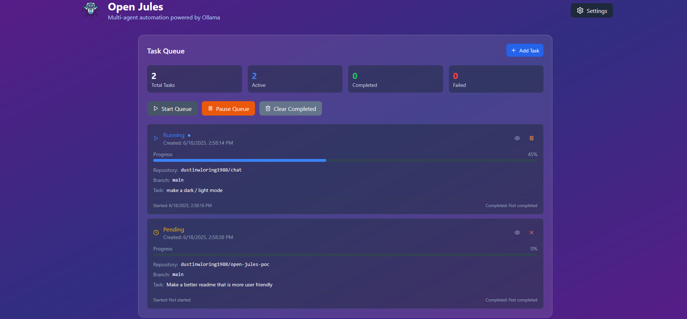

[](https://opensource.org/licenses/MIT)
[](CONTRIBUTING.md)



# Open Jules: Your AI Coding Co-pilot 🚀

**Tired of the coding grind? Open Jules is here to help!**

Open Jules is a powerful multi-agent automation platform that uses AI agents to automate coding tasks, from planning to pull request creation. Built with React, Node.js, and Ollama.

## 🚀 New Features - Task Queue System

Open Jules now features a robust task queue system that allows you to:

- **Queue Multiple Tasks**: Add multiple tasks to a queue and execute them sequentially
- **Individual Task Control**: Pause, resume, cancel, or remove individual tasks
- **Real-time Monitoring**: View detailed logs and progress for each task in real-time
- **Task Persistence**: Tasks persist across application restarts
- **Queue Management**: Start, pause, and clear completed tasks from the queue
- **Individual Console Viewing**: Open detailed console views for each task with export functionality

## Who is Open Jules For?

Open Jules is a great fit for:

*   **Developers** looking to automate routine coding tasks and speed up their workflow.
*   **Teams** wanting to streamline their development process and integrate AI assistance.
*   **Open-source enthusiasts** eager to experiment with local AI models for code generation.
*   **Anyone curious about AI-powered development** who wants a hands-on tool to explore.

If you're comfortable with GitHub and running local applications, Open Jules can be a powerful addition to your toolkit!

## 🚀 Quick Start Guide

Get Open Jules up and running in a few steps:

1.  **Prerequisites:**
    *   **Node.js:** Latest LTS version.
    *   **Ollama:** Installed and running ([ollama.com](https://ollama.com/)). Make sure you've pulled some models (e.g., `ollama pull llama3`).
    *   **Git:** Installed and in your PATH.

2.  **Installation:**
    ```bash
    git clone https://github.com/open-jules/open-jules.git
    cd open-jules
    npm install
    ```

3.  **Configuration:**
    *   Launch the app (see step 4).
    *   In the UI, go to **Settings**:
        *   Enter your **GitHub Personal Access Token**.
        *   Assign the **Ollama models** you've pulled to the different AI agents (Planner, Developer, etc.).

4.  **Run Open Jules:**
    ```bash
    npm run dev
    ```
    *   Access the app in your browser (usually `http://localhost:5173`).

For more detailed setup, troubleshooting, and advanced usage, please see our [Technical Details Guide](TECHNICAL_DETAILS.md).

## How to Use Open Jules

Once you've followed the Quick Start Guide and have Open Jules running:

1.  **Select Your Repository & Branch:**
    *   Choose the GitHub repository you want to work on.
    *   Pick the base branch for your changes.

2.  **Describe Your Task:**
    *   In the "Task Description" area, clearly explain what you want Open Jules to do.
    *   *Be specific!* For example, instead of "fix bug," try "Refactor `src/utils.js` to use arrow functions and add a unit test for the `calculateTotal` function."

3.  **Run the Task:**
    *   Click "Run Task."

4.  **Monitor Progress:**
    *   Watch the live status console to see the AI agents (Planner, Developer, etc.) at work.

5.  **Review Your PR:**
    *   Once complete, Open Jules will provide a link to the pull request on GitHub.
    *   Review the AI-generated code, test it, and merge if satisfied!

**Tips for Best Results:**

*   **Clear Instructions:** The more detailed your task description, the better the outcome.
*   **Model Choice:** Experiment with different Ollama models for agents (in Settings) to find what works best.
*   **Complex Tasks:** Break down large tasks into smaller, manageable steps for Open Jules.
*   Need more details on setup or advanced options? Check the [Technical Details Guide](TECHNICAL_DETAILS.md).

## Diving Deeper

Want to understand the nuts and bolts of Open Jules? For detailed information on:

*   Advanced configuration options
*   The system architecture
*   Project structure and codebase layout
*   Troubleshooting tips

Please refer to our [Technical Details Guide](TECHNICAL_DETAILS.md).

## Contributing

Please read [CONTRIBUTING.md](CONTRIBUTING.md) for details on our code of conduct and the process for submitting pull requests.

## License

This project is licensed under the MIT License - see the [LICENSE](LICENSE) file for details. 
